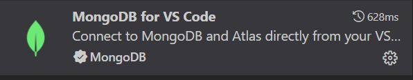
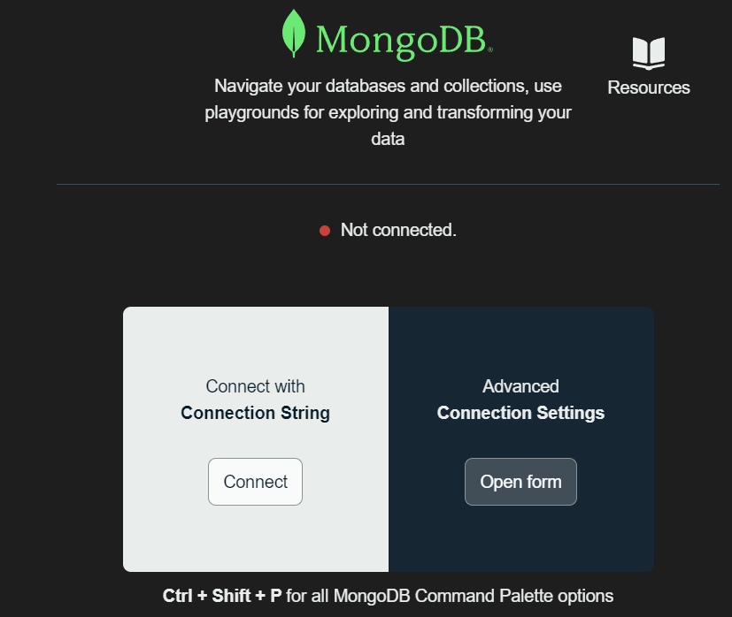
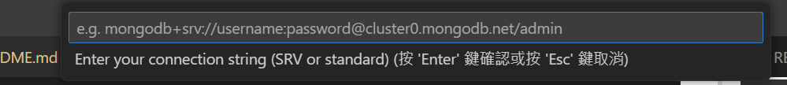

## 筆記
>執行:
>在bean能看到掃描到的檔案    
>並可以在裡面執行    

>頁面放在templates裡面    
>控制從controller裡面的java檔案做控制    
>DemoApplication是主程式    

## 語法
>SpringBoot可以用@做頁面控制    
>下圖會跑到index.html(如果放@home就會跑到home)，index是根目錄的預設值    
>return也可以控制templates的頁面，讓畫面顯示想要的html    

## 環境建置
>compiler:Vscode    
>程式語言:Java    
>架構:SpringBoot    
>Java版本:22    

## 延伸模組

## 連結至DataBase
> 搜尋MongoDB for VS Code
> 
> 左側找到
> 
> Add connection
> 點connect
> 
> 上方輸入Token
> 
> mongodb+srv://root:\<password\>@java.e2t1ilq.mongodb.net/
> <password\> 放在Discord裡的訂選